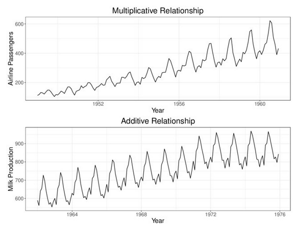
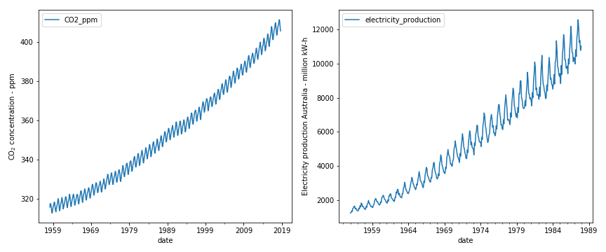
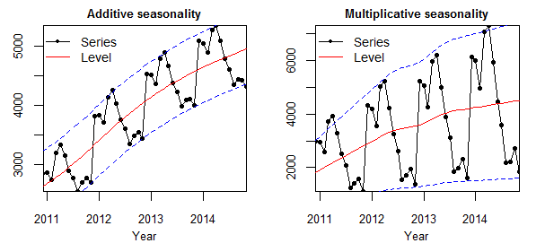

```{r}
#| label: setup
#| tbl-cap: "Library and theme setup"
library(forecast)
library(ggplot2)
library(ggpubr)
library(lubridate)
library(TSA)
library(gridExtra)

theme_ts <- function() {
  theme_bw(base_size = 12) +
    theme(
      plot.title    = element_text(face = "bold", hjust = 0.5),
      plot.subtitle = element_text(hjust = 0.5, colour = "grey40"),
      axis.title    = element_text(size = 11),
      legend.position = "bottom"
    )
}
```

# Introduction

## Learning Objectives

By the end of this chapter, students should be able to:

1.  Understand Time Series Fundamentals.
2.  Identify Time Series Components.
3.  Understand the Relationship Among Components.
4.  Measure Forecast Performance.
5.  Apply these concepts using R.

## Definition

A time series is fundamentally defined as a **time-oriented or chronological sequence of observations measured on a variable of interest**. These observations are typically collected sequentially over time at fixed, equally spaced intervals, referred to as the **sampling interval**.

Depending on the context, time series data can take several forms:

-   **Instantaneous measurements:** A reading taken at a specific point in time, such as the viscosity of a chemical product at the moment it is measured.
-   **Cumulative quantities:** An accumulated total over the interval, such as the total product demand or sales during a month.
-   **Summary statistics:** A metric that reflects activity of the variable during the time period, such as the daily closing price of a stock.

### Statistical and Mathematical Definition

A time series is modelled as a **discrete-time stochastic process** — a collection of random variables indexed according to the discrete time order in which they are obtained.

A time series of length $n$ is represented as:

$$\{y_t : t = 1, 2, \ldots, n\}$$

where the subscript $t$ denotes the discrete time period.

An important distinction:

| Concept | Description |
|------------------------------|------------------------------------------|
| **The Time Series Model** | The theoretical sequence of underlying random variables — the ensemble of possibilities |
| **The Realization** | The actual historical sequence of data observed; a single realization of the stochastic process |

### Arrangement of Time Series Data

```{r}
#| label: tbl-arrangement
#| tbl-cap: "Example arrangement of time series data"

df_example <- data.frame(
  t     = 1:6,
  Year  = 2018:2023,
  y_t   = c(3.4, 3.3, 3.9, 4.5, 3.7, 3.5)
)
knitr::kable(df_example, col.names = c("$t$", "Year", "$y_t$ (Unemployment Rate, %)"),
             align = "c")
```

## Categorization of Forecasting Models

{fig-align="center" width="85%"}

*Source: Wang, Shouyi & Chaovalitwongse, Wanpracha (2011). Evaluating and Comparing Forecasting Models.*

## Visualization of Time Series

A time series can be visualized via a **time series plot**.

### Example 1: Malaysia Unemployment Rate (1982–2020)

```{r}
#| label: fig-unemployment
#| fig-cap: "Malaysia Unemployment Rate, 1982–2020"
#| fig-height: 4

unrate   <- read.csv("data/employment.csv")
unratets <- ts(unrate$u_rate, start = 1982)

plot(unratets,
     ylab = "Unemployment Rate (%)", xlab = "Year", xaxt = "n",
     col = "steelblue", lwd = 1.5)
years <- seq(1982, 2020, by = 2)
axis(1, at = years, labels = years, las = 2)
title(sub = "Figure 1: Malaysia Unemployment Rate from 1982 to 2020",
      col.sub = "grey40")
```

### Example 2: Monthly Oil Price (Jan 1986 – Jan 2006)

```{r}
#| label: fig-oilprice
#| fig-cap: "Monthly price of oil, January 1986 – January 2006"
#| fig-height: 4

data(oil.price)
plot(oil.price, ylab = "Price per Barrel (USD)", type = "l",
     col = "darkred", lwd = 1.5)
title(sub = "Figure 2: Monthly Price of Oil: Jan 1986 – Jan 2006",
      col.sub = "grey40")
```

### Example 3: Monthly Sales of Specialty Oil Filters (1983–1987)

```{r}
#| label: fig-oilfilters
#| fig-cap: "Monthly sales of specialty oil filters, 1983–1987"
#| fig-height: 4

data(oilfilters)
plot(oilfilters, type = "l", ylab = "Sales", col = "darkgreen", lwd = 1.5)
points(y = oilfilters, x = time(oilfilters),
       pch = as.vector(season(oilfilters)))
title(sub = "Figure 3: Monthly Sales of Specialty Oil Filters, Jul 1983 – Jun 1987",
      col.sub = "grey40")
```

## Interpretation of Time Series Plot

When interpreting a time series plot, always include the following:

| Element      | Description                                               |
|--------------|-----------------------------------------------------------|
| **Minimum**  | The smallest value in the plot                            |
| **Maximum**  | The largest value in the plot                             |
| **Outliers** | Values much further away from the rest of the data points |
| **Trends**   | Patterns such as upward/downward movements or clusters    |

**Example interpretation (Figure 1):** *Malaysia's unemployment rate ranged from a minimum of 2.4% (1997) to a maximum of 7.4% (2020). The data shows a general downward trend from 1986 to 1997 and exhibits considerable fluctuation thereafter, with a sharp spike in 2020 likely attributed to the COVID-19 pandemic.*

------------------------------------------------------------------------

# Components of Time Series

A time series is typically composed of four components:

| Component | Notation | Description |
|------------------------|----------------------|----------------------------|
| Trend | $T_t$ | Long-run direction of the series |
| Seasonal | $S_t$ | Regular, repeating fluctuations within a fixed period |
| Cyclical | $C_t$ | Long-wave rises and falls around the trend |
| Irregular/Random | $I_t$ | Unpredictable, residual variation |

## Trend

The **trend component** describes the general upward or downward movements that characterise all economic and business activities.

### Types of Trends

| Type | Description |
|-----------------------|-------------------------------------------------|
| **Upward** | Values increase over time |
| **Downward** | Values decrease over time |
| **No Trend/Flat** | Values remain relatively stable |
| **Non-linear** | Exhibits curvature — exponential growth, logarithmic decay, etc. |

```{r}
#| label: fig-trend-types
#| fig-cap: "Four types of trend in time series data"
#| fig-height: 5

t  <- 1:60
p1 <- ggplot(data.frame(t, y = 10 + 0.5*t + rnorm(60, 0, 1.5)),
             aes(t, y)) + geom_line(colour="#d73027", linewidth=0.8) +
      labs(title="Upward Trend", x="Time", y="Value") + theme_ts()

p2 <- ggplot(data.frame(t, y = 40 - 0.5*t + rnorm(60, 0, 1.5)),
             aes(t, y)) + geom_line(colour="#4575b4", linewidth=0.8) +
      labs(title="Downward Trend", x="Time", y="Value") + theme_ts()

p3 <- ggplot(data.frame(t, y = 25 + rnorm(60, 0, 1.5)),
             aes(t, y)) + geom_line(colour="#1a9641", linewidth=0.8) +
      labs(title="No Trend / Flat Trend", x="Time", y="Value") + theme_ts()

p4 <- ggplot(data.frame(t, y = 10 * exp(0.04*t) + rnorm(60, 0, 3)),
             aes(t, y)) + geom_line(colour="#fc8d59", linewidth=0.8) +
      labs(title="Non-linear (Exponential) Trend", x="Time", y="Value") + theme_ts()

grid.arrange(p1, p2, p3, p4, nrow = 2)
```

### Importance of Studying Trends

-   Helps in making **forecasts and predictions** about future values.
-   Provides **insights into underlying patterns and relationships** which useful for decision-making.
-   Helps **identify potential anomalies or changes** in data behaviour over time.

### Identifying Trends

-   **Visual Inspection:** Plotting the time series and observing the overall direction.
-   **Statistical Techniques:** Linear regression or moving averages.

### Trend Using Simple Linear Regression

In simple linear regression for trend, the independent variable is time $t$ where $t = 1, 2, \ldots, n$:

$$\hat{T}_t = \hat{\beta}_0 + \hat{\beta}_1 t$$

```{r}
#| label: fig-linear-trend
#| fig-cap: "Output of electricity index with fitted linear trend (Jan 2015 – Dec 2023)"
#| fig-height: 4

prod    <- read.csv("data/electric.csv")
electric <- data.frame(t = seq(1:108), index = prod[1:108, 3])

ggplot(data = electric, aes(x = t, y = index)) +
  geom_line(colour = "grey50", linewidth = 0.7) +
  geom_smooth(method = "lm", colour = "#d73027", se = TRUE) +
  stat_regline_equation(label.x = 30, label.y = 130) +
  labs(title = "Output of Electricity Index with Linear Trend",
       x = "Time (months, Jan 2015 = 1)",
       y = "Output of Electricity (Index)") +
  theme_ts()
```

```{r}
#| label: lm-summary

lm_fit <- lm(index ~ t, data = electric)
# Linear regression output
summary(lm_fit)
```

> **Excel Tutorial:** <https://youtu.be/n6e71G9PImc>

### Trend Using Moving Average

$$M_t^{(k)} = \frac{1}{k}\sum_{i=0}^{k-1} y_{t-i}$$

- If $k = 3$: $M_1 = \dfrac{y_1 + y_2 + y_3}{3}$ — **3-period moving average**
- If $k = 5$: $M_1 = \dfrac{y_1 + y_2 + y_3 + y_4 + y_5}{5}$ — **5-period moving average**

::: {.callout-note}
- The larger $k$ is, the **smoother** the series, but more observations are **lost** at both ends.
- The first $\lfloor k/2 \rfloor$ and last $\lfloor k/2 \rfloor$ observations are lost from the moving average series.
:::

```{r}
#| label: fig-moving-average
#| fig-cap: "Electricity output index: actual vs. 3-period and 5-period moving averages"
#| fig-height: 4

ma3 <- ma(electric$index, 3)
ma5 <- ma(electric$index, 5)

matplot(electric$t,
        cbind(electric$index, ma3, ma5),
        type = "l", lty = 1, col = c("red", "blue", "green"),
        xlab = "Time (months)", ylab = "Output Index",
        main = "Moving Average Trend")
legend("bottom", legend = c("Actual", "3-period MA", "5-period MA"),
       col = c("red", "blue", "green"), lty = 1, bty = "n")
```

> **Excel Tutorial:** <https://youtu.be/FODxTjhY5TM>

------------------------------------------------------------------------

## Seasonal

The **seasonal component** refers to a recurring pattern that repeats at **regular, fixed** intervals (daily, weekly, monthly, or yearly).

### Causes of Seasonal Patterns

| Factor | Example |
|----------------------------------|--------------------------------------|
| **Weather** | Palm oil production influenced by rainfall (November–March, east coast Malaysia) |
| **Holidays** | Tourist numbers peak during school holidays |
| **Cultural Events** | Zakat collection highest during Hari Raya Eidulfitri |

### Identifying Seasonal Components

-   **Visual Inspection:** Plotting the time series and observing recurring patterns.
-   **Seasonal Decomposition:** STL or classical decomposition methods.
-   **Statistical Tests:** Autocorrelation function (ACF) analysis *(Chapter 5)*.

```{r}
#| label: fig-seasonal
#| fig-cap: "Monthly electricity output index showing seasonal pattern (2015–2023)"
#| fig-height: 4

electric$date <- seq(from = as.Date("2015-01-01"),
                     to   = as.Date("2023-12-01"),
                     by   = "month")

ggplot(data = electric, aes(x = date, y = index)) +
  geom_line(colour = "steelblue", linewidth = 0.8) +
  scale_x_date(date_labels = "%b %Y", date_breaks = "6 months") +
  labs(title = "Monthly Electricity Output Index (Jan 2015 to Dec 2023)",
       x = "Year", y = "Electric Consumption (Index)") +
  theme_minimal(base_size = 11) +
  theme(axis.text.x = element_text(angle = 90, hjust = 1))
```

```{r}
#| label: fig-seasonal-decomp
#| fig-cap: "Classical additive decomposition of the electricity index"
#| fig-height: 5

elec_ts <- ts(electric$index, start = c(2015, 1), frequency = 12)
decomp  <- decompose(elec_ts, type = "additive")
autoplot(decomp) +
  labs(title = "Additive Decomposition: Electricity Output Index") +
  theme_bw(base_size = 11)
```

> **Excel Tutorial:** <https://youtu.be/Wwlx2IgB7uw>

------------------------------------------------------------------------

## Cyclical

**Cyclical variation** refers to rises and falls of the series over an **unspecified** period, usually around the long-run trend line.

::: callout-important
-   Requires **sufficiently long** data — typically **more than 5 years**.
-   Easier to detect with **yearly** data.
-   There is **no fixed period** for cyclical recurrence (unlike seasonal).
-   Identification is challenging because data patterns are typically **not stable**.
:::

{fig-align="center" width="80%"}

*Source: <https://www.mathworks.com/help/econ/choose-time-series-filter-for-business-cycle-analysis.html>*

### Methods to Identify Cyclical Variation

#### Residual Method

$$\text{Percent of Trend} = \frac{y_t}{\hat{T}_t} \times 100$$

| Value   | Interpretation                  |
|---------|---------------------------------|
| $< 100$ | Economy contracting (recession) |
| $> 100$ | Economy expanding               |

#### Relative Cyclical Residual Method

$$\text{Relative Cyclical Residual} = \frac{y_t - \hat{T}_t}{\hat{T}_t} \times 100$$

| Value    | Interpretation                   |
|----------|----------------------------------|
| Negative | Trend pulled down by recession   |
| Positive | Output above average (expansion) |

------------------------------------------------------------------------

## Irregular / Random

The **irregular or random component** is the portion that **cannot be explained** by trend, seasonal, or cyclical components. It has four distinct sub-types:

| Sub-type | Key Characteristic | Visual Pattern |
|------------------|------------------------------|------------------------|
| **Turning Point** | Trend permanently changes direction | Sustained shift in slope |
| **Random Shock** | Sudden, temporary spike or dip | Sharp impulse, then recovery |
| **Outlier** | One extreme isolated value | Single point far from neighbours |
| **Pure Noise** | Small unpredictable fluctuations | Irregular scatter around zero |

### Turning Point

A **turning point** is where the long-run direction **permanently reverses** — from upward to downward or vice versa. Unlike a shock, the series does **not recover** to its prior direction.

**Examples:**

-   Introduction of robotic manufacturing permanently raises production.
-   Sudden change in consumer preference shifts demand to a new sustained level.
-   Policy change (e.g., new minimum wage legislation) permanently alters labour market dynamics.

```{r}
#| label: fig-turning-point
#| fig-cap: "Turning points in Malaysia's unemployment rate (1982–2020)"
#| fig-height: 4.5

unrate <- read.csv("data/employment.csv")
df_u   <- data.frame(
  Year   = as.numeric(format(as.Date(unrate$date), "%Y")),
  u_rate = unrate$u_rate
)

ggplot(df_u, aes(x = Year, y = u_rate)) +
  geom_line(colour = "steelblue", linewidth = 0.9) +
  geom_point(size = 1.8, colour = "steelblue") +
  geom_point(data = df_u[df_u$Year == 1986, ],
             aes(x = Year, y = u_rate),
             colour = "#d73027", size = 4, shape = 17) +
  annotate("label", x = 1986, y = df_u$u_rate[df_u$Year == 1986] + 0.5,
           label = "Peak (1986)\nTurning Point ↓",
           colour = "#d73027", fill = "white", size = 3.2, label.size = 0.3) +
  geom_point(data = df_u[df_u$Year == 1997, ],
             aes(x = Year, y = u_rate),
             colour = "#1a9641", size = 4, shape = 25) +
  annotate("label", x = 1997, y = df_u$u_rate[df_u$Year == 1997] - 0.6,
           label = "Trough (1997)\nTurning Point ↑",
           colour = "#1a9641", fill = "white", size = 3.2, label.size = 0.3) +
  geom_point(data = df_u[df_u$Year == 2020, ],
             aes(x = Year, y = u_rate),
             colour = "#fc8d59", size = 4, shape = 17) +
  annotate("label", x = 2019, y = df_u$u_rate[df_u$Year == 2020] + 0.5,
           label = "COVID-19 (2020)\nShock / Turning Point?",
           colour = "#fc8d59", fill = "white", size = 3.2, label.size = 0.3) +
  labs(title = "Turning Points in Malaysia's Unemployment Rate (1982–2020)",
       subtitle = "▲ Peak = trend reverses downward  |  ▽ Trough = trend reverses upward",
       x = "Year", y = "Unemployment Rate (%)") +
  theme_ts()
```


```{r}
#| label: fig-turning-point2
#| fig-cap: "Turning point — the trend permanently reverses direction at the marked point"
#| fig-height: 4

t_tp  <- 1:80
# Before turning point: upward; after: downward
y_tp  <- ifelse(t_tp <= 45,
                20 + 0.5 * t_tp,
                20 + 0.5 * 45 - 0.4 * (t_tp - 45)) +
         rnorm(80, 0, 1.2)

df_tp <- data.frame(t = t_tp, y = y_tp)

ggplot(df_tp, aes(x = t, y = y)) +
  geom_line(colour = "#4575b4", linewidth = 0.9) +
  geom_vline(xintercept = 45, linetype = "dashed", colour = "#d73027",
             linewidth = 1) +
  annotate("label", x = 45, y = max(y_tp) - 1,
           label = "Turning Point\n(t = 45)", colour = "#d73027",
           fill = "white", size = 3.5, label.size = 0.3) +
  annotate("segment", x = 5, xend = 42, y = 22, yend = 40,
           arrow = arrow(length = unit(0.15, "cm")),
           colour = "#1a9641", linewidth = 0.8) +
  annotate("text", x = 15, y = 26, label = "Upward trend",
           colour = "#1a9641", size = 3.5) +
  annotate("segment", x = 48, xend = 75, y = 42, yend = 30,
           arrow = arrow(length = unit(0.15, "cm")),
           colour = "#d73027", linewidth = 0.8) +
  annotate("text", x = 62, y = 38, label = "Downward trend",
           colour = "#d73027", size = 3.5) +
  labs(title = "Turning Point in a Time Series",
       subtitle = "Before t = 45: upward trend  |  After t = 45: downward trend",
       x = "Time", y = "Value") +
  theme_ts()
```

::: callout-note
**Turning point vs. Random Shock:** A turning point results in a **permanent direction change**. After a random shock, the series **recovers** toward its previous level.
:::

------------------------------------------------------------------------

### Random Shock

A **random shock** is an abrupt, **temporary** spike or drop caused by an unexpected external event. The series typically recovers toward its prior level once the event passes.

**Examples:**

-   Crude oil price sudden drop due to COVID-19.
-   Production of masks increasing tremendously during the pandemic.
-   Stock market crash following a geopolitical crisis or natural disaster.

```{r}
#| label: fig-random-shock
#| fig-cap: "Random shocks in monthly oil prices (Jan 1986 – Jan 2006)"
#| fig-height: 4.5

data(oil.price)
oil_df <- data.frame(Date = as.numeric(time(oil.price)),
                     Price = as.numeric(oil.price))

ggplot(oil_df, aes(x = Date, y = Price)) +
  geom_line(colour = "steelblue", linewidth = 0.8) +
  annotate("rect", xmin = 1990, xmax = 1991.5,
           ymin = -Inf, ymax = Inf, alpha = 0.15, fill = "#d73027") +
  annotate("label", x = 1990.75, y = 40,
           label = "Gulf War\nshock (1990–91)",
           colour = "#d73027", fill = "white", size = 3, label.size = 0.3) +
  annotate("rect", xmin = 1997.5, xmax = 1999.5,
           ymin = -Inf, ymax = Inf, alpha = 0.15, fill = "#4575b4") +
  annotate("label", x = 1998.5, y = 44,
           label = "Asian Financial\nCrisis (1998)",
           colour = "#4575b4", fill = "white", size = 3, label.size = 0.3) +
  annotate("rect", xmin = 2003, xmax = 2006,
           ymin = -Inf, ymax = Inf, alpha = 0.12, fill = "#fc8d59") +
  annotate("label", x = 2004.5, y = 20,
           label = "Iraq War &\nprice surge",
           colour = "#a63603", fill = "white", size = 3, label.size = 0.3) +
  labs(title = "Random Shocks in Monthly Oil Prices (Jan 1986 – Jan 2006)",
       subtitle = "Each shaded region marks an unexpected external event",
       x = "Year", y = "Price per Barrel (USD)") +
  theme_ts()
```

```{r}
#| label: fig-shock-recovery
#| fig-cap: "Gulf War shock (1990–91): price spikes then recovers to prior trend"
#| fig-height: 5

oil_sub <- oil_df[oil_df$Date >= 1989.5 & oil_df$Date <= 1995, ]
lm_pre  <- lm(Price ~ Date, data = oil_df[oil_df$Date < 1990, ])
oil_sub$trend <- predict(lm_pre, newdata = data.frame(Date = oil_sub$Date))

ggplot(oil_sub, aes(x = Date)) +
  geom_line(aes(y = Price, colour = "Observed"), linewidth = 0.9) +
  geom_line(aes(y = trend, colour = "Pre-shock trend"),
            linetype = "dashed", linewidth = 1) +
  annotate("segment", x = 1990.25, xend = 1991.5, y = 38, yend = 22,
           arrow = arrow(length = unit(0.15, "cm")), colour = "#d73027") +
  annotate("text", x = 1990, y = 39, label = "Spike then\nrecovery",
           colour = "#d73027", size = 3.2) +
  scale_colour_manual(values = c("Observed" = "steelblue",
                                 "Pre-shock trend" = "#d73027")) +
  labs(title = "Gulf War Shock: Price Recovers to Pre-shock Level",
       x = "Year", y = "Price per Barrel (USD)", colour = NULL) +
  theme_ts()
```

```{r}
#| label: fig-random-shock2
#| fig-cap: "Random shock — a sudden spike followed by recovery to the previous level"
#| fig-height: 4

t_sh  <- 1:80
trend_sh <- 30 + 0.2 * t_sh
noise_sh <- rnorm(80, 0, 1.2)
shock    <- rep(0, 80)
shock[40] <- -18   # sudden sharp downward shock
shock[41] <- -10
shock[42] <- -4    # gradual recovery

y_sh  <- trend_sh + shock + noise_sh
df_sh <- data.frame(t = t_sh, y = y_sh)

ggplot(df_sh, aes(x = t, y = y)) +
  geom_line(colour = "#4575b4", linewidth = 0.9) +
  annotate("rect", xmin = 39, xmax = 43, ymin = -Inf, ymax = Inf,
           alpha = 0.15, fill = "#d73027") +
  annotate("label", x = 41, y = min(y_sh) + 3,
           label = "Shock period\n(e.g. COVID-19)", colour = "#d73027",
           fill = "white", size = 3.5, label.size = 0.3) +
  annotate("segment", x = 43, xend = 55, y = y_sh[42] + 1, yend = 35,
           arrow = arrow(length = unit(0.15, "cm")), colour = "#1a9641",
           linewidth = 0.8) +
  annotate("text", x = 58, y = 35.5, label = "Recovery",
           colour = "#1a9641", size = 3.5) +
  labs(title = "Random Shock in a Time Series",
       subtitle = "Sharp temporary drop followed by recovery to original trend",
       x = "Time", y = "Value") +
  theme_ts()
```

```{r}
#| label: fig-shock-comparison
#| fig-cap: "Comparison: impulse shock (single period) vs. sustained shock (multiple periods)"
#| fig-height: 3.5

t2    <- 1:60
base  <- 20 + 0.15 * t2

# Single-period impulse
y_imp <- base + rnorm(60, 0, 0.8)
y_imp[30] <- y_imp[30] + 12

# Multi-period sustained shock (e.g. supply chain disruption for 5 months)
shock_sus <- rep(0, 60)
shock_sus[30:34] <- c(8, 10, 9, 7, 4)
y_sus <- base + shock_sus + rnorm(60, 0, 0.8)

df_imp <- data.frame(t = t2, y = y_imp, type = "Single-period Impulse")
df_sus <- data.frame(t = t2, y = y_sus, type = "Sustained Shock (5 periods)")
df_cmp <- rbind(df_imp, df_sus)

ggplot(df_cmp, aes(x = t, y = y)) +
  geom_line(colour = "#4575b4", linewidth = 0.8) +
  facet_wrap(~type, scales = "free_y") +
  labs(title = "Types of Random Shock",
       x = "Time", y = "Value") +
  theme_ts()
```
------------------------------------------------------------------------

### Outliers

An **outlier** is an isolated data point that **significantly deviates** from the overall pattern. Unlike a random shock (which spans several periods), an outlier is typically a **single observation**.

Outliers arise from: errors in data collection, measurement instrument failure, or genuinely unusual one-off events.

```{r}
#| label: fig-outliers
#| fig-cap: "Outliers in a time series — isolated extreme data points"
#| fig-height: 6

t_out  <- 1:60
y_out  <- 50 + 0.3 * t_out + rnorm(60, 0, 2)
# Inject outliers
y_out[15] <- y_out[15] + 20   # high outlier
y_out[42] <- y_out[42] - 18  # low outlier

# Z-score to flag outliers
z_scores  <- abs(scale(y_out))
is_outlier <- z_scores > 2.5

df_out <- data.frame(t = t_out, y = y_out, outlier = as.vector(is_outlier))

ggplot(df_out, aes(x = t, y = y)) +
  geom_line(colour = "grey50", linewidth = 0.7) +
  geom_point(aes(colour = outlier, size = outlier)) +
  scale_colour_manual(values = c("FALSE" = "#4575b4", "TRUE" = "#d73027"),
                      labels = c("FALSE" = "Normal", "TRUE" = "Outlier")) +
  scale_size_manual(values = c("FALSE" = 1.5, "TRUE" = 3.5)) +
  annotate("label", x = 15, y = y_out[15] + 2,
           label = "High outlier\n(data entry error?)",
           colour = "#d73027", fill = "white", size = 3.2, label.size = 0.3) +
  annotate("label", x = 42, y = y_out[42] - 3,
           label = "Low outlier\n(instrument failure?)",
           colour = "#d73027", fill = "white", size = 3.2, label.size = 0.3) +
  labs(title = "Outliers in a Time Series",
       subtitle = "Flagged using Z-score threshold > 2.5",
       x = "Time", y = "Value", colour = NULL, size = NULL) +
  theme_ts()
```

**How to detect outliers:**

1.  **Visual inspection** of the time series plot.
2.  **Z-score method** — flag where $|z_t| = |\frac{y_t - \bar{y}}{s}| > 2.5$.
3.  **IQR method** — flag outside $[Q_1 - 1.5 \times IQR,\ Q_3 + 1.5 \times IQR]$.
4.  **Decomposition residuals** — inspect the irregular component after removing trend and seasonal effects.

**How to deal with outliers:**

| Strategy          | When to Use                                        |
|-------------------|----------------------------------------------------|
| **Remove**        | Confirmed data entry errors or instrument failures |
| **Winsorize**     | Replace with boundary value (5th/95th percentile)  |
| **Impute**        | Replace with average of neighbours                 |
| **Robust models** | Use outlier-resistant forecasting techniques       |

------------------------------------------------------------------------

### Random (Pure Noise)

The **random** sub-component refers to small, unpredictable fluctuations that remain after all systematic effects are removed. Also called the **residual** or **error** term.

Random errors are expected to be $I_t \sim N(0, \sigma^2)$ and uncorrelated across time.

```{r}
#| label: fig-residuals
#| fig-cap: "Irregular (residual) component from the electricity index decomposition"
#| fig-height: 4.5

elec_ts <- ts(electric$index, start = c(2015, 1), frequency = 12)
decomp  <- decompose(elec_ts, type = "additive")
resid_df <- data.frame(Date     = as.numeric(time(elec_ts)),
                       Residual = as.numeric(decomp$random))

p1 <- ggplot(resid_df, aes(x = Date, y = Residual)) +
  geom_line(colour = "grey40", linewidth = 0.7, na.rm = TRUE) +
  geom_hline(yintercept = 0, linetype = "dashed", colour = "#d73027") +
  geom_hline(yintercept =  2 * sd(decomp$random, na.rm = TRUE),
             linetype = "dotted", colour = "#4575b4") +
  geom_hline(yintercept = -2 * sd(decomp$random, na.rm = TRUE),
             linetype = "dotted", colour = "#4575b4") +
  annotate("text", x = 2023.5, y =  2 * sd(decomp$random, na.rm = TRUE) + 0.2,
           label = "+2σ", colour = "#4575b4", size = 3.2, hjust = 1) +
  annotate("text", x = 2023.5, y = -2 * sd(decomp$random, na.rm = TRUE) - 0.3,
           label = "−2σ", colour = "#4575b4", size = 3.2, hjust = 1) +
  labs(title = "Irregular Component (Random Noise)", x = "Year",
       y = expression(I[t])) + theme_ts()

p2 <- ggplot(na.omit(resid_df), aes(x = Residual)) +
  geom_histogram(aes(y = after_stat(density)), bins = 12,
                 fill = "#4575b4", alpha = 0.7, colour = "white") +
  stat_function(fun  = dnorm,
                args = list(mean = mean(decomp$random, na.rm = TRUE),
                            sd   = sd(decomp$random, na.rm = TRUE)),
                colour = "#d73027", linewidth = 1) +
  labs(title = "Distribution of Residuals",
       subtitle = expression("Should approximate " * N(0, sigma^2)),
       x = expression(I[t]), y = "Density") + theme_ts()

grid.arrange(p1, p2, ncol = 2)
```

### Summary: Distinguishing Irregular Sub-types

| Sub-type | Duration | Reversible? | Real Example |
|-----------------|-----------------|-------------------|--------------------|
| **Turning Point** | Permanent | No | Malaysia unemployment 1986, 1997 |
| **Random Shock** | Few periods | Yes — recovers | Gulf War oil spike 1990 |
| **Outlier** | Single period | N/A | Flagged oil filter observation |
| **Pure Noise** | Throughout | N/A | Electricity residuals |

```{r}
#| label: fig-all-irregular
#| fig-cap: "Side-by-side comparison of the four irregular component sub-types"
#| fig-height: 7

t_all <- 1:80
base_all <- 30 + 0.2 * t_all

# 1. Turning Point
y1 <- ifelse(t_all <= 45,
             base_all,
             base_all[45] - 0.35 * (t_all - 45)) + rnorm(80, 0, 1)

# 2. Random Shock
shock2 <- rep(0, 80); shock2[c(35, 36, 37)] <- c(-15, -8, -3)
y2 <- base_all + shock2 + rnorm(80, 0, 1)

# 3. Outlier
y3 <- base_all + rnorm(80, 0, 1)
y3[25] <- y3[25] + 22

# 4. Pure Noise
y4 <- base_all + rnorm(80, 0, 3.5)

make_plot <- function(t, y, title, subtitle, highlight = NULL,
                      vline = NULL) {
  df <- data.frame(t = t, y = y)
  g  <- ggplot(df, aes(x = t, y = y)) +
    geom_line(colour = "#4575b4", linewidth = 0.8) +
    labs(title = title, subtitle = subtitle, x = "Time", y = "Value") +
    theme_ts() +
    theme(plot.subtitle = element_text(size = 9))
  if (!is.null(highlight)) {
    g <- g +
      geom_point(data = df[highlight, ], aes(x = t, y = y),
                 colour = "#d73027", size = 3)
  }
  if (!is.null(vline)) {
    g <- g +
      geom_vline(xintercept = vline, linetype = "dashed",
                 colour = "#d73027", linewidth = 0.9)
  }
  g
}

pa <- make_plot(t_all, y1, "Turning Point",
                "Permanent change in trend direction", vline = 45)
pb <- make_plot(t_all, y2, "Random Shock",
                "Sharp temporary impulse, then recovery", highlight = 35:37)
pc <- make_plot(t_all, y3, "Outlier",
                "Single isolated extreme value", highlight = 25)
pd <- make_plot(t_all, y4, "Pure Random Noise",
                "Small unpredictable fluctuations throughout")

grid.arrange(pa, pb, pc, pd, nrow = 2)
```

::: {.callout-tip}
**Key distinctions at a glance:**

- **Turning point** → slope changes permanently after one point.
- **Random shock** → sharp deviation for a few periods, then the series recovers.
- **Outlier** → exactly one data point is extreme; neighbours are normal.
- **Pure noise** → small irregular deviations with no pattern throughout the whole series.
:::

::: callout-tip
**Quick visual check:**

-   Does the trend **permanently change direction**? → Turning Point
-   Does the series **spike then return** to where it was? → Random Shock
-   Is **one single point** unusually extreme? → Outlier
-   Are there **small unpatterned wiggles** throughout? → Pure Noise
:::

------------------------------------------------------------------------

# Relationship Among Components

## Additive Effect

In the **additive model**, seasonal variation is constant — its magnitude is independent of the level of the series.

$$\hat{Y}_t = T_t + S_t + C_t + I_t$$

## Multiplicative Effect

In the **multiplicative model**, seasonal variation grows proportionally with the level of the data series.

$$\hat{Y}_t = T_t \times S_t \times C_t \times I_t$$

## Additive vs. Multiplicative

```{r}
#| label: fig-additive-multiplicative
#| fig-cap: "Additive vs. multiplicative decomposition of the electricity output index"
#| fig-height: 7

elec_ts <- ts(electric$index, start = c(2015, 1), frequency = 12)
p_add <- autoplot(decompose(elec_ts, "additive")) +
  labs(title = "Additive Decomposition") + theme_bw(base_size = 10)
p_mul <- autoplot(decompose(elec_ts, "multiplicative")) +
  labs(title = "Multiplicative Decomposition") + theme_bw(base_size = 10)
grid.arrange(p_add, p_mul, ncol = 2)
```

| Feature | Additive | Multiplicative |
|-------------------|---------------------|---------------------------------|
| Seasonal magnitude | Constant | Grows with level |
| Use when | Seasonal swings roughly constant | Seasonal swings widen as series grows |
| Linearisation | Not needed | Apply log transform |
| R function | `decompose(ts, type = "additive")` | `decompose(ts, type = "multiplicative")` |

::: callout-tip
If seasonal fluctuations **grow proportionally** with the level of the series → use multiplicative. If they remain **roughly constant** → use additive.
:::

### Examples

::: {#fig-addmult-examples layout-ncol=1}

{#fig-example1}

{#fig-example2}

{#fig-example3}

Real-world examples illustrating additive and multiplicative seasonal patterns.
:::

------------------------------------------------------------------------

# Measuring Performance

## Data Partition

| Part                      | Purpose                   | Rule of Thumb |
|---------------------------|---------------------------|---------------|
| **Estimation (Training)** | Fit the forecasting model | 80% of data   |
| **Evaluation (Test)**     | Assess forecast accuracy  | 20% of data   |

```{r}
#| label: data-partition

cpi   <- read.csv("data/CPI Malaysia.csv", check.names = FALSE)
cpits <- ts(cpi$`Consumer price index (2010 = 100)`,
            start = 1960, frequency = 1)

est_part <- head(cpits, 0.8 * length(cpits))
eva_part <- tail(cpits, 0.2 * length(cpits))

str(est_part)
str(eva_part)
```

```{r}
#| label: fig-data-partition
#| fig-cap: "Data partition: 80% estimation, 20% evaluation — Malaysia CPI"
#| fig-height: 3.5

n_est <- length(est_part)
n_eva <- length(eva_part)

df_cpi <- data.frame(
  Year  = as.numeric(time(cpits)),
  Value = as.numeric(cpits),
  Part  = c(rep("Estimation (80%)", n_est), rep("Evaluation (20%)", n_eva))
)

ggplot(df_cpi, aes(x = Year, y = Value, colour = Part)) +
  geom_line(linewidth = 0.9) +
  geom_vline(xintercept = as.numeric(time(cpits))[n_est],
             linetype = "dashed", colour = "black") +
  annotate("label",
           x = as.numeric(time(cpits))[n_est],
           y = max(as.numeric(cpits)) * 0.7,
           label = "Partition\ncut-off", size = 3.2,
           fill = "white", label.size = 0.3) +
  scale_colour_manual(values = c("Estimation (80%)" = "#4575b4",
                                 "Evaluation (20%)" = "#d73027")) +
  labs(title = "Malaysia CPI: Data Partition for Forecasting Evaluation",
       x = "Year", y = "CPI (2010 = 100)", colour = NULL) +
  theme_ts()
```


## Error Measures

The criterion used to differentiate between a poor and a good forecast model is called an **error measure**.

### Mean Square Error (MSE)

$$\text{MSE} = \frac{1}{n} \sum_{t=1}^{n} (y_t - \hat{y}_t)^2$$

| | |
|--|--|
| **Advantage** | Easy to compute; penalises large errors more heavily |
| **Disadvantage** | Highly sensitive to large forecast errors; not in original units |

### Mean Absolute Percentage Error (MAPE)

$$\text{MAPE} = \frac{1}{n} \sum_{t=1}^{n} \left| \frac{y_t - \hat{y}_t}{y_t} \right| \times 100$$

| | |
|--|--|
| **Advantage** | Easy to interpret (%); scale-independent — allows comparison across datasets |
| **Disadvantage** | Undefined when $y_t = 0$; not suitable for negative values |

### Mean Absolute Error (MAE)

$$\text{MAE} = \frac{1}{n} \sum_{t=1}^{n} |y_t - \hat{y}_t|$$

| | |
|--|--|
| **Advantage** | Robust to outliers; in original units; easy to compute |
| **Disadvantage** | Treats all forecast errors equally regardless of magnitude |

::: callout-note
- The **best model** produces the **lowest** error measure value.
- A truly good model gives consistently low values **across multiple error measures**.
:::

## Example: Malaysia CPI Data

### Model 1 — Linear Trend

```{r}
#| label: model1

n          <- length(cpits)
n_train    <- length(est_part)   # derived from actual 80% split
n_test     <- n - n_train
time_train <- 1:n_train
time_test  <- (n_train + 1):n

model1 <- lm(est_part ~ time_train)
summary(model1)
```

```{r}
#| label: model1-errors

pred1      <- predict(model1, newdata = data.frame(time_train = time_test))
actual     <- as.numeric(eva_part)
predicted1 <- as.numeric(pred1)

mse1  <- mean((actual - predicted1)^2)
mape1 <- mean(abs((actual - predicted1) / actual)) * 100
mae1  <- mean(abs(actual - predicted1))

cat("=== Model 1: Linear Trend ===\n")
cat("MSE  :", round(mse1,  4), "\n")
cat("MAE  :", round(mae1,  4), "\n")
cat("MAPE :", round(mape1, 4), "%\n")
```

### Model 2 — Quadratic Trend

```{r}
#| label: model2

model2 <- lm(est_part ~ time_train + I(time_train^2))
summary(model2)
```

```{r}
#| label: model2-errors

pred2      <- predict(model2, newdata = data.frame(time_train = time_test))
predicted2 <- as.numeric(pred2)

mse2  <- mean((actual - predicted2)^2)
mape2 <- mean(abs((actual - predicted2) / actual)) * 100
mae2  <- mean(abs(actual - predicted2))

cat("=== Model 2: Quadratic Trend ===\n")
cat("MSE  :", round(mse2,  4), "\n")
cat("MAE  :", round(mae2,  4), "\n")
cat("MAPE :", round(mape2, 4), "%\n")
```

### Model Comparison

```{r}
#| label: tbl-model-comparison
#| tbl-cap: "Error measure comparison: linear vs. quadratic trend"

library(kableExtra)

knitr::kable(
  data.frame(Model = c("Linear", "Quadratic"),
             MSE   = round(c(mse1, mse2),  4),
             MAE   = round(c(mae1, mae2),  4),
             MAPE  = round(c(mape1, mape2), 4)),
  col.names = c("Model", "MSE", "MAE", "MAPE (%)"),
  align = "c"
) %>%
  kable_styling() %>%
  row_spec(2, bold = TRUE, background = "#FFFFCC")
```

### 4-Year Forecast

```{r}
#| label: forecast

h             <- 4
time_all      <- 1:n
time_forecast <- (n + 1):(n + h)

final_model     <- lm(cpits ~ time_all + I(time_all^2))
forecast_values <- predict(final_model,
                           newdata  = data.frame(time_all = time_forecast),
                           interval = "prediction")
print(forecast_values)
```

```{r}
#| label: fig-forecast
#| fig-cap: "Malaysia CPI: observed data and 4-year quadratic trend forecast"
#| fig-height: 4.5
#| echo: false

last_year      <- max(cpi$Year)
forecast_years <- (last_year + 1):(last_year + h)

plot_data <- data.frame(Year = cpi$Year, CPI = as.numeric(cpits),
                        Type = "Observed")
forecast_plot_data <- data.frame(Year = forecast_years,
                                 CPI  = forecast_values[, "fit"],
                                 Type = "Forecast")
ci_data <- data.frame(Year  = forecast_years,
                      Lower = forecast_values[, "lwr"],
                      Upper = forecast_values[, "upr"])

ggplot() +
  geom_line(data = plot_data,
            aes(x = Year, y = CPI, colour = "Observed"), linewidth = 1) +
  geom_point(data = plot_data,
             aes(x = Year, y = CPI, colour = "Observed"), size = 1.5) +
  geom_line(data = forecast_plot_data,
            aes(x = Year, y = CPI, colour = "Forecast"),
            linewidth = 1, linetype = "dashed") +
  geom_point(data = forecast_plot_data,
             aes(x = Year, y = CPI, colour = "Forecast"),
             size = 3, shape = 17) +
  geom_ribbon(data = ci_data,
              aes(x = Year, ymin = Lower, ymax = Upper),
              alpha = 0.2, fill = "blue") +
  scale_colour_manual(values = c("Observed" = "black", "Forecast" = "red")) +
  labs(title  = "CPI Malaysia: Observed Data and 4-Year Forecast",
       x = "Year", y = "Consumer Price Index (2010 = 100)", colour = "Series") +
  theme_minimal(base_size = 11) +
  theme(plot.title = element_text(size = 14, face = "bold"),
        legend.position = "bottom", panel.grid.minor = element_blank())
```

------------------------------------------------------------------------

# Summary

-   A **time series** is defined as $\{y_t : t = 1, 2, \ldots, n\}$ — data indexed in ascending time order.
-   A time series plot interpretation should include minimum, maximum, outliers, and overall trends.
-   Four components: **Trend**, **Seasonal**, **Cyclical**, and **Irregular/Random**.
-   The **Irregular** component has four sub-types: **Turning Point**, **Random Shock**, **Outlier**, and **Pure Noise**.
-   Component relationships are modelled as **Additive** or **Multiplicative**.
-   Performance is measured via **MSE**, **MAPE**, and **MAE** on an 80/20 data split — lowest value wins.

------------------------------------------------------------------------

# References

-   Mohd Alias Lazim, *Introductory Business Forecasting: A Practical Approach*, 3rd ed., UPENA, UiTM, 2013.
-   <https://open.dosm.gov.my/data-catalogue>
